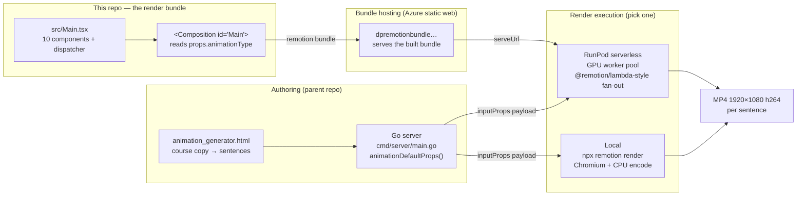
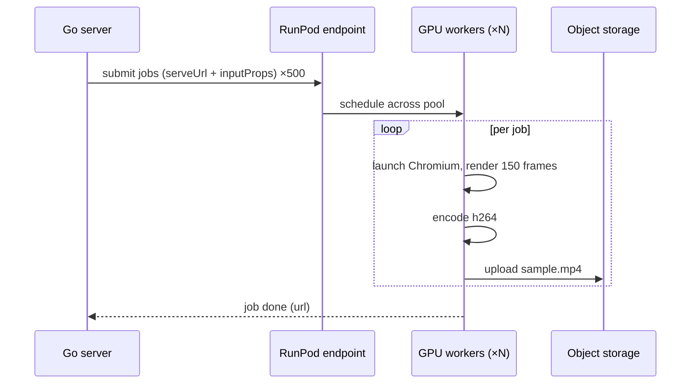

# 🏛️ Architecture — `my-claude-animations`

How this Remotion bundle turns course copy into video, how the same bundle runs
**locally** and on **RunPod serverless GPU**, and the **performance / cost**
trade-off between the two.

> **TL;DR** — For these animations (DOM/CSS/SVG, no WebGL), a single clip renders
> in **~5 s on an M1 Max** and won't get dramatically faster on a GPU. RunPod's
> value is **horizontal throughput** (render hundreds of clips in parallel,
> off your laptop), not per-clip speed. Local is effectively free but serial and
> ties up your machine; RunPod costs roughly **$1–3 per full course batch** but
> finishes a large batch in minutes.

---

## 1. System overview

This repo is **only the render bundle** — the React/Remotion code plus a single
`<Composition id="Main">` that dispatches to all 10 animation types via
`props.animationType`. It is intentionally stateless and side-effect free: feed
it `inputProps`, get back one MP4.

**Key contract:** the props this bundle consumes are byte-for-byte the
`animationDefaultProps()` output in the parent project's `cmd/server/main.go`.
That's what makes local render and serverless render produce *identical* frames —
the only thing that changes is **where Chromium runs**.

### Components

| Piece | Lives in | Role |
|-------|----------|------|
| `src/Main.tsx` | this repo | 10 animation components + `DISPATCH` map |
| `src/Root.tsx` | this repo | registers `<Composition id="Main">`, `defaultProps` |
| Built bundle | Azure `$web` | static JS the renderer loads via `serveUrl` |
| Go server | parent repo | builds `inputProps`, submits render jobs |
| Renderer | local **or** RunPod | runs headless Chromium → frames → h264 |

---

## 2. How RunPod runs this

RunPod doesn't run `src/` directly — it runs the **built bundle** plus the
Remotion renderer inside a container. The flow:

1. **Build & publish the bundle once.** `npx remotion bundle` produces static JS
   (the same artifact `deploy-bundle.sh` ships to Azure). RunPod workers fetch it
   by `serveUrl`, so a bundle change is a re-deploy, not a re-build per job.
2. **Container image.** A RunPod serverless endpoint runs an image that has
   Node + a headless Chromium (Remotion's `@remotion/renderer` / browser deps)
   baked in. The handler receives a job, calls `renderMedia({ serveUrl,
   composition: "Main", inputProps })`, and uploads the MP4 to object storage
   (S3/R2/Azure Blob).
3. **Job submission.** The Go server POSTs one job per sentence:
   `{ serveUrl, composition: "Main", inputProps: animationDefaultProps(type, …) }`.
4. **Fan-out.** RunPod's serverless scheduler spins up *N* workers and runs jobs
   concurrently — this is the whole point. 1 sentence or 500 sentences use the
   same code path; throughput scales with the worker pool.
5. **Collect.** Each worker writes its MP4 to a bucket; the server stitches /
   collects them.

> **Why GPU at all?** For Remotion, the GPU accelerates Chromium's compositing
> and (optionally) hardware h264 encode. For **WebGL / heavy shader / 3D**
> scenes that's a large win. **These 10 templates are DOM + CSS + SVG with no
> WebGL**, so they are largely **CPU + Chromium bound** — a GPU helps modestly
> per clip. The serverless model still wins because it runs *many clips at once*.

---

## 3. Performance: local vs RunPod

Measured baseline on this machine:

| Metric | Value |
|--------|-------|
| Machine | Apple **M1 Max**, 10 cores |
| Single clip (`concept_reveal`, 150 frames @ 1920×1080) | **4.78 s** wall (incl. bundle load + encode) |
| Full batch (all 10 types) | **< 60 s** wall, serial |

Extrapolating to a realistic course batch (illustrative — assume **500
sentences** ≈ 500 clips, ~5 s each):

| Scenario | Concurrency | Wall-clock for 500 clips | Notes |
|----------|-------------|--------------------------|-------|
| **Local (M1 Max)** | serial (1 at a time) | **~42 min** | laptop pinned, fans on, can't use it |
| **Local (M1 Max)** | ~3–4 parallel renders | **~12–15 min** | RAM/CPU contention, diminishing returns |
| **RunPod, 1 warm worker** | 1 | **~45–60 min** | + cold start; *slower* than M1 for trivial scenes |
| **RunPod, 20 workers** | 20 | **~2–4 min** | the actual reason to use it |
| **RunPod, 50 workers** | 50 | **~1–2 min** | bounded by cold-starts + scheduler overhead |

Takeaways:

- **Per-clip, a fast Apple-silicon laptop is competitive with — or beats — a
  single cloud GPU worker** for these lightweight 2D scenes. Don't expect a 10×
  per-clip speedup from RunPod here.
- **RunPod wins on aggregate throughput**: it turns a 40-minute serial grind
  into a 2–3 minute parallel burst and frees your machine.
- **Cold starts matter for short jobs.** A 5-second render behind a 15–40 s
  container cold start is dominated by overhead. Keep workers warm (min-workers
  ≥ 1) or batch multiple sentences per job to amortize startup.

---

## 4. Cost implications

### Local
- **Marginal cost ≈ $0.** You pay only amortized hardware + electricity.
- **Hidden cost:** your machine is unavailable during the batch, and you can't
  scale past one box. Fine for a handful of clips or iterative preview; painful
  for a full-course re-render.

### RunPod (serverless GPU)

Cost = `GPU-seconds billed × per-second rate`, independent of how many workers
run in parallel (parallelism buys *time*, not lower *total* cost). Add
cold-start seconds and storage egress.

> ⚠️ **Verify current RunPod pricing before relying on these.** Serverless GPU
> rates change and depend on tier/region. Figures below are *illustrative orders
> of magnitude*, using ~$0.00044/GPU-s (≈ $1.58/hr, a mid-tier 24 GB GPU).

| Batch | Compute | Est. GPU-seconds | Est. cost (compute) |
|-------|---------|------------------|---------------------|
| 1 clip | 5 s render + ~15 s cold start | ~20 s | **~$0.01** |
| 50 clips (warm pool) | 50 × ~6 s | ~300 s | **~$0.13** |
| 500 clips (warm pool) | 500 × ~6 s | ~3000 s | **~$1.30** |
| 500 clips (all cold, no warm pool) | 500 × ~21 s | ~10 500 s | **~$4.60** |

Plus:
- **Storage / egress** for the MP4s (a 500-clip course ≈ ~220 MB at the ~440 KB
  average measured here) — typically cents.
- **Idle / min-worker** charges if you keep workers warm to kill cold starts.

### Rule of thumb

| If you are… | Render where |
|-------------|--------------|
| Iterating on one animation / previewing | **Local** (`remotion studio`, instant) |
| Rendering a handful of finals | **Local** (free, ~5 s each) |
| Re-rendering a whole course / many sentences | **RunPod fan-out** (~$1–5, minutes not an hour) |
| On a slow/old CPU laptop | **RunPod** even for small batches |

The economically rational pattern: **author + preview locally, mass-render on
RunPod**. The shared `inputProps` contract guarantees the cloud output matches
what you previewed.

---

## 5. Cost-control checklist for RunPod

- Keep **min-workers ≥ 1** during a render session to avoid per-job cold starts;
  scale to 0 when idle.
- **Batch several sentences per job** so a single Chromium launch amortizes
  across multiple renders (startup is the tax, not the rendering).
- Pick the **cheapest GPU tier that fits** — these scenes don't need a 4090/A100;
  a 16–24 GB mid-tier card is plenty since the bottleneck is Chromium/CPU.
- Render to the **bucket in the same region** as the workers to minimise egress.
- Re-deploy the bundle (Azure/`serveUrl`) only when `src/` changes — the bundle
  is cached and shared by every worker.

---

## 6. Related

- Live gallery of these samples: <https://rifaterdemsahin.github.io/my-claude-animations/>
- Bundle deploy recipe: [`deploy-bundle.sh`](./deploy-bundle.sh)
- Parent project: [claude-architect-certification](https://github.com/rifaterdemsahin/claude-architect-certification)
- RunPod setup guide: [`4_Formula/tools/remotion_runpod_setup.md`](https://github.com/rifaterdemsahin/claude-architect-certification/blob/main/4_Formula/tools/remotion_runpod_setup.md)
- Remotion rendering docs: <https://www.remotion.dev/docs/render>
